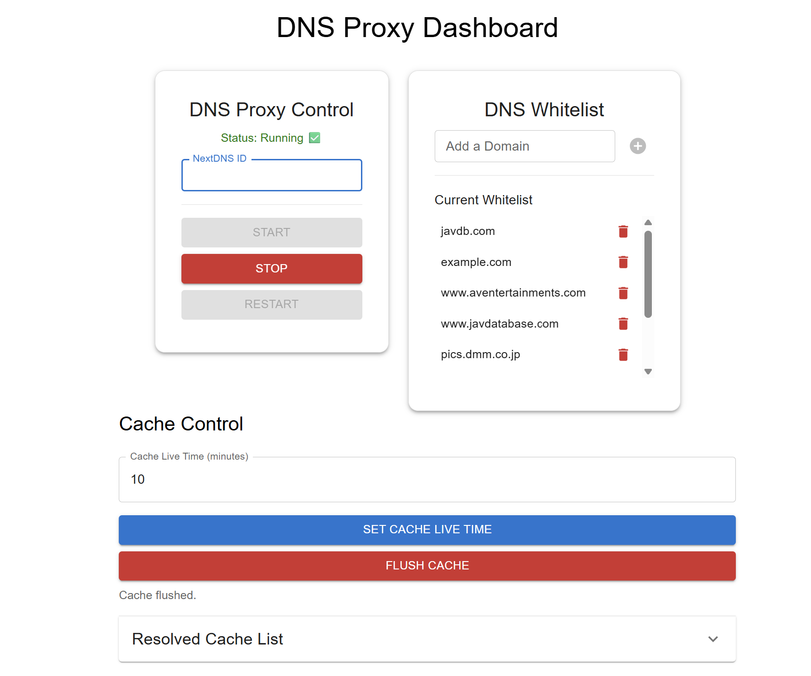

# 🛡️ DNS Proxy with Whitelist + Cache Control

# DNS Proxy Server 🌐⚡

[](https://bun.sh/)
[](LICENSE)
[](https://github.com/yourusername/dns-proxy/stargazers)

A simple but powerful DNS Proxy server that:

- Uses NextDNS or Cloudflare to resolve queries 🔄
- Supports domain **whitelisting** ✅
- Uses in-memory **caching** for faster responses ⚡
- Includes a clean **frontend dashboard** to manage everything 🖥️



---

## 🚀 Features

- **DNS over HTTPS** resolver (NextDNS + Cloudflare fallback)
- **Whitelist control**: Allow specific domains to resolve via NextDNS
- **Cache system**: Boosts performance and reduces external lookups
- **API & Web UI**: Easily manage whitelist, cache, and server status
- Built with **Bun.js** (ultra-fast runtime)

---

## 📦 Installation & Setup

### 1. Clone the Repo

```bash
git clone https://github.com/yourusername/dns-proxy.git
cd dns-proxy
```

### 2. Running the server

Make sure you have Bun installed (v1.2.3+).

```bash
bun install
bun run build
sudo bun run start
```

The API server will start at:
http://localhost:3000

## 3. Note

The server need to run dgram server listening on ort 53, which require admin privileges, hence sudo command is used.

## 📡 Configure Your Device to Use This DNS Proxy

### 1. Find your server's IP address

(e.g., 192.168.1.100)

### 2. On your device (PC, router, smartphone), go to DNS settings and set:

```bash
Primary DNS: 192.168.1.100
Secondary DNS: (optional, or leave blank)
```

Save and restart network connection.
Now all DNS queries will go through your proxy server!

## 🌐 Usage Guide

### ✅ Whitelist Control (Domain Filtering)

- Open your browser and go to: [http://localhost:3000](http://localhost:3000)
- Use the **"DNS Whitelist"** panel to:
  - Add domains you want to resolve through **NextDNS** (e.g., `example.com`).
  - Remove domains you no longer want whitelisted.

Whitelisted domains will bypass normal fallback rules and resolve via **NextDNS**.  
Non-whitelisted domains will resolve via **Cloudflare** by default.

---

### ⚡ Cache Management

Boost performance and control DNS query caching!

- Use the **Cache Control** panel in the UI to:
  - View current cached entries.
  - Flush (clear) the cache manually.
  - Set cache TTL (time-to-live) duration in seconds.

This helps reduce external lookups and speeds up repeated queries.

---

## ⚠️ License (Use at Your Own Risk)

This project is licensed under the **MIT License** — meaning:

- ✅ You are free to use, modify, and share it.
- ❌ However, there is **no warranty**.
- ⚠️ Use this tool at **your own risk**. I am not responsible for any damage, misuse, or issues caused by this software.
